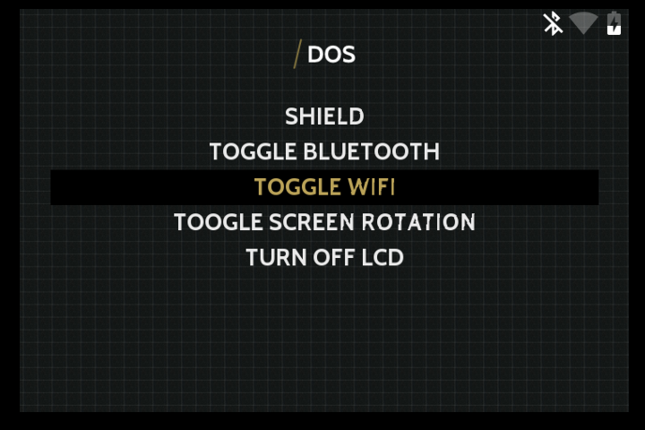
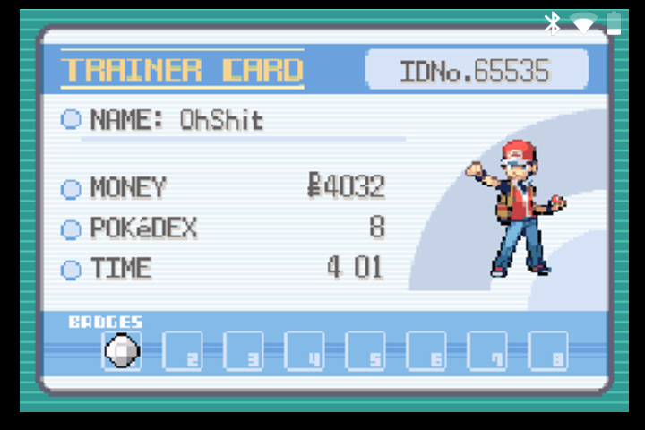
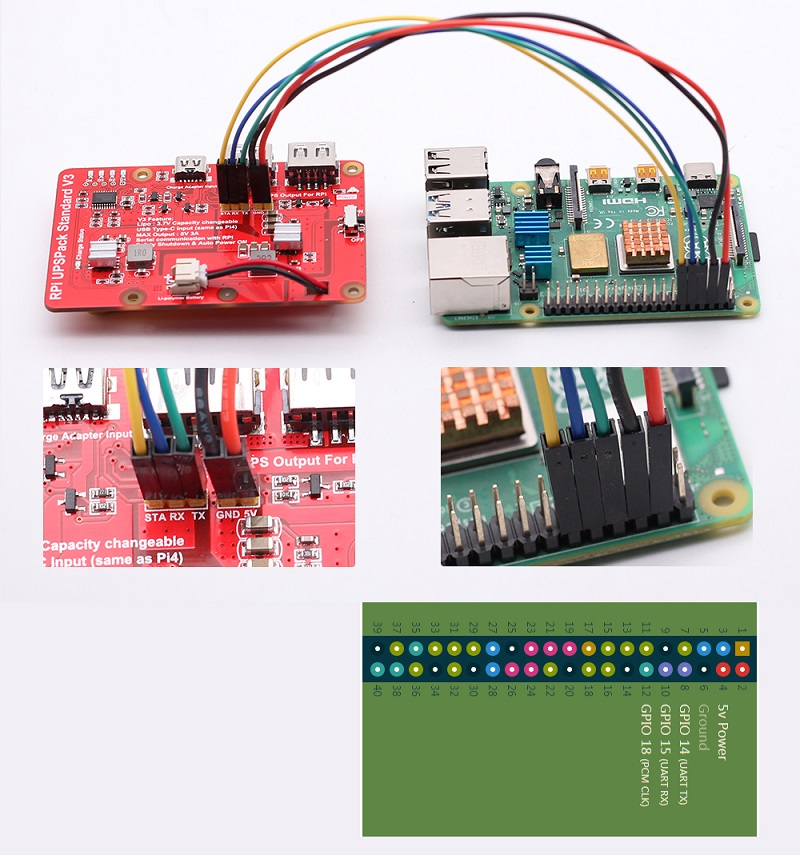
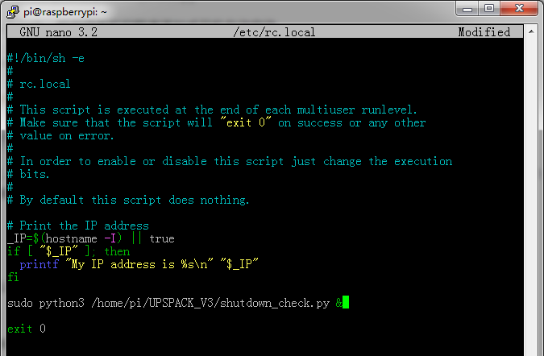

# Gameboy Zero RetroPie status overlays
This repository contains a script to display lovely slightly-transparent overlays on top of your RetroPie games and emulationstation menus

## What can it do?
- display battery level (Requires ADS1x15)
- display WiFi state (connected/disconnected/disabled)
- display Bluetooth state (connected/disconnected/disabled)
- display under-voltage state
- display warning if frequency-capped
- display warning if throttling
- adjust icons' position to current display resolution
- gracefully shut down the Pi after 60s from when voltage goes below 3.2V
- show a big imminent shutdown warning when the counter starts ticking

## What do I need to get it running?
- See [installation instructions](#installation-instructions) below for setup steps
- [pngview](https://github.com/AndrewFromMelbourne/raspidmx/tree/master/pngview) from AndrewFromMelbourne
- [material-design-icons](https://github.com/google/material-design-icons/archive/master.zip) from Google
- Adafruit ADS1015 with Vbat on A0 (or alternative)
- a symbolic link to *overlay\_icons/ic\_battery\_alert\_red\_white\_36dp.png* under *material\_design\_icons\_master/device/drawable-mdpi/*
- an entry in crontab to start this on boot
- check and adjust paths in the script header if required
- some battery readings calibration - check logs
- some patience

## But what does it look like?
Like that:

  
Bluetooth, wifi connected, battery discharging

  
Bluetooth, wifi disconnected, battery discharging

  
Bluetooth, wifi disabled, battery charging

  
CPU throttled due to high temperature

  
Under-Voltage, Freq-capped due to high temperature, battery critical, shutdown imminent warning - shutting down in 60s

  
In-game
### -1. install display configuration

    over_voltage=6
    arm_freq=2000
    gpu_freq=750

    force_turbo=1
    
    hdmi_force_edid_audio=1
    max_usb_current=1
    hdmi_force_hotplug=1
    config_hdmi_boost=7
    hdmi_group=2
    hdmi_mode=87
    hdmi_drive=2
    display_rotate=0                             
    hdmi_timings=1024 1 50 18 50 600 1 15 3 15 0 0 0 60 0 40000000 3  
    dtoverlay=gpio-shutdown
    
    enable_uart=1
    #dtoverlay=disable-bt
    dtoverlay=miniuart-bt

### 0. Install nintendo switch 

    
    git clone https://github.com/nicman23/dkms-hid-nintendo
    cd dkms-hid-nintendo
    sudo dkms add .
    sudo dkms build nintendo -v 3.2
    sudo dkms install nintendo -v 3.2
    sudo apt-get install libevdev-dev
    git clone https://github.com/DanielOgorchock/joycond.git
    cd joycond
    cmake .
    sudo make install
    sudo systemctl enable --now joycond
### 0.1 Install things with bluetooth     
    sudo apt install bluetooth blueman bluez-hcidump checkinstall libusb-dev libbluetooth-dev joystick pkg-config
    sudo apt install pi-bluetooth
        

https://retropie.org.uk/docs/Nintendo-Switch-Controllers/ ,
https://retropie.org.uk/docs/PS3-Controller/?h=bluetooth#persisting-bluetooth-ps3controller-only ,
https://retropie.org.uk/docs/Bluetooth-Controller/?h=blu ,
https://github.com/Julesheredia879/nintendo_retropie.git and 
https://projects.raspberrypi.org/en/projects/nix-python-reading-serial-data

### 0.2 UPS instalation

  
cables

### 0.3 software https://github.com/rcdrones/UPSPACK_V3.git
    sudo nano /etc/rc.local
    
    #Add the following to the line above the exit at the bottom of the page
    
    sudo python3 /home/pi/UPSPACK_V3/shutdown_check.py &

  
cables

## Installation Instructions

SSH into your device or access the terminal using F4. We're assuming you already have Internet access configured

### 1. Install pngview by AndrewFromMelbourne
    mkdir ~/src && cd ~/src
    git clone --depth 1 https://github.com/AndrewFromMelbourne/raspidmx.git
    cd raspidmx/
    make -j4
    sudo cp pngview/pngview /usr/local/bin/

### 2. Download the script and install dependencies:
    mkdir ~/scripts && cd ~/scripts
    git clone --depth 1 https://github.com/Julesheredia879/nintendo_retropie.git
    sudo apt-get update
    sudo apt-get install build-essential python3-dev python3-smbus python3-pip
    sudo pip3 install pyserial

#### 3. Test the script:

    sudo python3 /home/pi/scripts/nintendo_retropie/overlay.py &
    sudo apt-get remove --purge pulseaudio
    
You should now see overlay icons

### 4. Set up script autostart
Note: Do not use rc.local, it's deprecated

    sudo crontab -e

Then at the bottom of the file, add the line:

    @reboot python3 /home/pi/scripts/gbz_overlay/overlay.py

You can use this one-liner instead if you prefer:

    (crontab -l ; echo "@reboot python3 /home/pi/scripts/gbz_overlay/overlay.py") | crontab -

### 5. Reboot

    sudo apt-get install --no-install-recommends bluetooth
    sudo service bluetooth status

### Connection issues (input lag & ghost inputs) (especially if you connect more than one BT controller)
Try reducing distance from your controller to Raspberry (helps sometimes)
Try to disable internal WiFi - this helps to extent signal strength, you can use this script to disable/enable Wifi on the fly (several users report PS3 controller connections problems are vanished since)
Try forcing a lower baud rate in /usr/bin/btuart, on line 22: $HCIATTACH /dev/serial1 bcm43xx xxxxxx noflow - $BDADDR. Smaller values of 115200 and 230400 have been known to alleviate input lag / ghost input on a Pi 3B.
Buy a new BT adapter and put it to your Raspberry. Add dtoverlay=pi3-disable-bt in /boot/config.txt to disable internal BT module (ultima ratio, speeds up communication, extents range and speed depending on your BT adapter model)

    sudo nano /usr/bin/btuart

### 6. Temperature
    vcgencmd measure_temp
